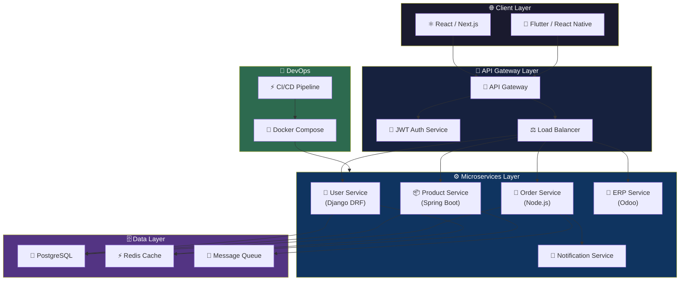
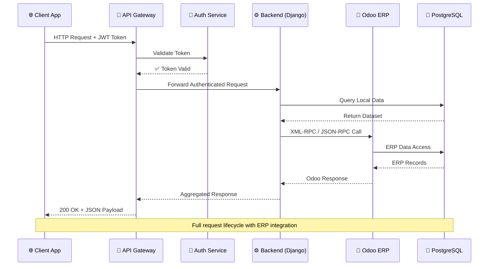
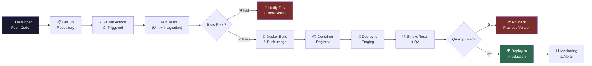
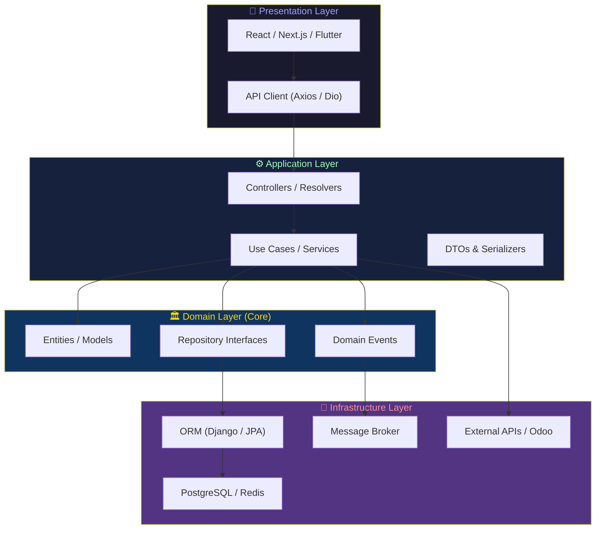
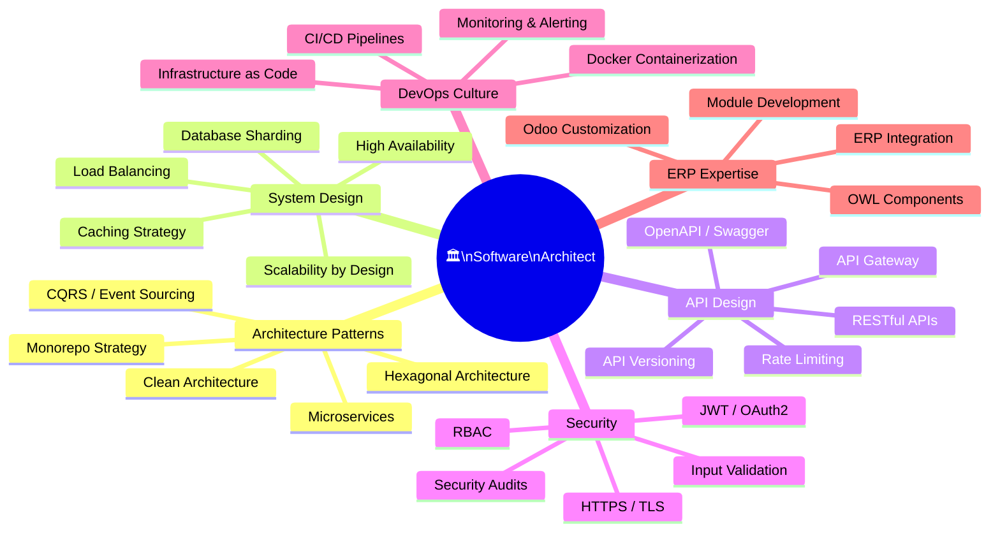

<!-- HERO BANNER -->
<div align="center">


<!-- Typing SVG Animation -->

[](https://git.io/typing-svg)

<br/>


</div>

---

<!-- ═══════════════════════════════════════════════════════════ -->
<!-- SECTION 1 — HERO CODE BLOCK (JAVA)                        -->
<!-- ═══════════════════════════════════════════════════════════ -->

<div align="center">

## 〔 `Hello World` 〕

</div>

```java
/**
 * @author   VOTRE NOM
 * @version  PRODUCTION
 * @since    2024
 * @location Cameroon 🌍
 */

@SoftwareArchitect
@SeniorEngineer
public final class Developer {

    private static final String NAME       = "VOTRE NOM";
    private static final String ROLE       = "Fullstack Engineer & Software Architect";
    private static final String LOCATION   = "Cameroon, Africa 🌍";
    private static final String STATUS     = "Open to Collaboration & Opportunities";

    private final String[] expertise = {
        "🏗️  Software Architecture & System Design",
        "⚡  Backend Engineering (Django · Spring Boot · Node.js)",
        "🎨  Frontend Engineering (React · Next.js · Vue.js)",
        "📱  Mobile Development (Flutter · React Native)",
        "🔗  ERP Integration & Odoo Customization",
        "☁️  Microservices & Scalable Platforms",
        "🔐  API Design · JWT · Security First",
        "🐳  DevOps · Docker · CI/CD Pipelines"
    };

    private final Philosophy philosophy = new Philosophy()
        .add("Clean Code")
        .add("SOLID Principles")
        .add("Domain Driven Design")
        .add("Event Driven Architecture")
        .add("Performance & High Availability");

    public void initialize() {
        System.out.println("🚀 Designing systems that scale.");
        System.out.println("⚙️  Engineering solutions that last.");
        System.out.println("🎯  Delivering value through great architecture.");
    }

    public String getCurrentFocus() {
        return "Building enterprise-grade SaaS platforms & ERP systems.";
    }

    public boolean isAvailableForWork() { return true; }
}
```

---

<!-- ═══════════════════════════════════════════════════════════ -->
<!-- SECTION 2 — PYTHON CLASS: ABOUT ME                        -->
<!-- ═══════════════════════════════════════════════════════════ -->

<div align="center">

## 〔 `About Me` 〕

</div>

```python
#!/usr/bin/env python3
# -*- coding: utf-8 -*-
"""
Module      : about_me.py
Engineer    : VOTRE NOM
Description : Who I am, what I build, why it matters.
"""

from dataclasses import dataclass, field
from typing import List

@dataclass
class SoftwareArchitect:
    """
    Passionate engineer focused on building robust, scalable,
    and maintainable software systems — from architecture blueprints
    to production-ready deployments.
    """

    name: str        = "VOTRE NOM"
    title: str       = "Fullstack Engineer · Software Architect · ERP Integrator"
    location: str    = "Cameroon 🌍"
    available: bool  = True

    passions: List[str] = field(default_factory=lambda: [
        "Clean Architecture & Domain Driven Design",
        "High-performance RESTful APIs & Microservices",
        "ERP customization & enterprise automation with Odoo",
        "Industrializing dev workflows with JHipster & CI/CD",
        "Building SaaS products that solve real-world problems",
        "Mobile-first experiences with Flutter & React Native",
    ])

    currently_doing: List[str] = field(default_factory=lambda: [
        "🔭 Designing scalable microservices architectures",
        "🌱 Deepening expertise in Event Driven Architecture",
        "🤝 Open for freelance, collaborations & consulting",
        "📦 Contributing to open-source ERP tooling",
    ])

    def vision(self) -> str:
        return (
            "Great software is not just written — it's engineered. "
            "Every line of code should reflect intention, clarity, and craftsmanship. "
            "My mission: design systems that scale, teams that thrive, "
            "and products that endure."
        )

    def contact(self) -> dict:
        return {
            "email"    : "votre@email.com",
            "linkedin" : "linkedin.com/in/VOTRE_PROFIL",
            "portfolio": "yourportfolio.dev",
            "github"   : "github.com/VOTRE_USERNAME",
        }

if __name__ == "__main__":
    me = SoftwareArchitect()
    print(f"👋 Hi, I'm {me.name}")
    print(f"💡 Vision: {me.vision()}")
```

---

<!-- ═══════════════════════════════════════════════════════════ -->
<!-- SECTION 3 — TYPESCRIPT INTERFACE: TECH PROFILE            -->
<!-- ═══════════════════════════════════════════════════════════ -->

<div align="center">

## 〔 `Tech Profile` 〕

</div>

```typescript
// tech-profile.ts
// ─────────────────────────────────────────────────────────────
// Engineer   : VOTRE NOM
// Role       : Software Architect & Fullstack Engineer
// ─────────────────────────────────────────────────────────────

interface TechStack {
  backend: string[];
  frontend: string[];
  mobile: string[];
  erp: string[];
  devops: string[];
  databases: string[];
  architecture: string[];
}

interface EngineerProfile {
  name: string;
  stack: TechStack;
  principles: string[];
  available: boolean;
}

const profile: EngineerProfile = {
  name: "VOTRE NOM",
  available: true,

  stack: {
    backend: ["Python", "Django", "DRF", "Java", "Spring Boot", "Node.js"],
    frontend: ["React.js", "Next.js", "Vue.js", "TypeScript", "TailwindCSS"],
    mobile: ["Flutter", "React Native"],
    erp: ["Odoo", "PostgreSQL", "XML-RPC", "OWL Framework"],
    devops: ["Docker", "Git", "Linux", "CI/CD", "JHipster", "GitHub Actions"],
    databases: ["PostgreSQL", "MySQL", "Redis", "MongoDB"],
    architecture: [
      "Microservices",
      "REST APIs",
      "Event Driven Architecture",
      "Domain Driven Design",
      "Clean Architecture",
      "CQRS",
      "API Gateway",
      "JWT / OAuth2",
    ],
  },

  principles: [
    "SOLID",
    "DRY",
    "KISS",
    "YAGNI",
    "Separation of Concerns",
    "Test Driven Development",
    "Security First",
    "Performance by Design",
  ],
};

export const buildGreatSoftware = (): void => {
  console.log(
    `🚀 ${profile.name} — Architecting the future, one commit at a time.`,
  );
};
```

---

<!-- ═══════════════════════════════════════════════════════════ -->
<!-- SECTION 4 — VISUAL TECH STACK                             -->
<!-- ═══════════════════════════════════════════════════════════ -->

<div align="center">

## 〔 `Tech Stack` 〕

</div>

<div align="center">

### ⚡ Backend

[](https://python.org)
[](https://djangoproject.com)
[](https://java.com)
[](https://spring.io)
[](https://nodejs.org)

---

### 🎨 Frontend

[](https://react.dev)
[](https://nextjs.org)
[](https://vuejs.org)
[](https://typescriptlang.org)
[](https://tailwindcss.com)

---

### 📱 Mobile

[](https://flutter.dev)
[](https://reactnative.dev)

---

### 🗄️ Databases & ERP

[](https://postgresql.org)
[](https://mysql.com)
[](https://redis.io)
[](https://mongodb.com)


---

### 🐳 DevOps & Tools

[](https://docker.com)
[](https://git-scm.com)
[](https://linux.org)
[](https://github.com/features/actions)


</div>

---

<!-- ═══════════════════════════════════════════════════════════ -->
<!-- SECTION 5 — ARCHITECTURE DIAGRAMS (MERMAID)               -->
<!-- ═══════════════════════════════════════════════════════════ -->

<div align="center">

## 〔 `Architecture Blueprints` 〕

</div>

### 🏗️ Microservices Architecture



---

### 🔗 ERP Integration Flow



---

### 🚀 CI/CD Deployment Pipeline



---

### 🧱 Fullstack Clean Architecture



---

<!-- ═══════════════════════════════════════════════════════════ -->
<!-- SECTION 6 — NEXT.JS CONFIG BLOCK                          -->
<!-- ═══════════════════════════════════════════════════════════ -->

<div align="center">

## 〔 `Frontend Architecture` 〕

</div>

```javascript
// next.config.js — Production Architecture Setup
// ─────────────────────────────────────────────────────────────
// Engineer : VOTRE NOM | Software Architect
// Stack    : Next.js · TypeScript · TailwindCSS · DRF · JWT
// ─────────────────────────────────────────────────────────────

/** @type {import('next').NextConfig} */

const architectureConfig = {
  engineer: "VOTRE NOM",
  specialization: "Fullstack & Software Architecture",

  frontendStack: [
    "Next.js 14",
    "TypeScript",
    "TailwindCSS",
    "Zustand",
    "React Query",
  ],
  backendAPIs: ["Django REST Framework", "Spring Boot", "Node.js/Express"],
  authStrategy: "JWT + Refresh Token Rotation + OAuth2",
  rendering: ["SSR", "SSG", "ISR", "CSR — Context-aware strategy"],

  performanceTargets: {
    LCP: "< 1.2s",
    FID: "< 50ms",
    CLS: "< 0.05",
    TTI: "< 2.0s",
  },

  designPrinciples: [
    "Component-driven development",
    "Feature-based folder structure",
    "API abstraction layers",
    "Global state management",
    "Optimistic UI updates",
    "Accessibility (a11y) first",
  ],
};

module.exports = {
  reactStrictMode: true,
  swcMinify: true,
  output: "standalone",
  images: { domains: ["your-cdn.com", "api.yourapp.com"] },
  async headers() {
    return [{ source: "/(.*)", headers: securityHeaders }];
  },
};

// 🚀 Architected for performance. Engineered for scale.
```

---

<!-- ═══════════════════════════════════════════════════════════ -->
<!-- SECTION 7 — SOFTWARE ARCHITECT EXPERTISE                  -->
<!-- ═══════════════════════════════════════════════════════════ -->

<div align="center">

## 〔 `Software Architect Expertise` 〕

</div>



---

<!-- ═══════════════════════════════════════════════════════════ -->
<!-- SECTION 8 — GITHUB STATS                                   -->
<!-- ═══════════════════════════════════════════════════════════ -->

<div align="center">

## 〔 `GitHub Analytics` 〕

<br/>


<br/><br/>


<br/><br/>


</div>

---

<!-- ═══════════════════════════════════════════════════════════ -->
<!-- SECTION 9 — PROJECTS PREMIUM                              -->
<!-- ═══════════════════════════════════════════════════════════ -->

<div align="center">

## 〔 `Featured Projects` 〕

</div>

<table>
<tr>
<td width="50%">

### 🏢 Enterprise ERP Platform

> _Odoo-based ERP solution for multi-company management_


- ✅ Custom Odoo modules & OWL components
- ✅ Multi-company, multi-currency support
- ✅ REST API layer for external integrations
- ✅ Automated reporting & invoicing

[](https://github.com/VOTRE_USERNAME/erp-platform)

</td>
<td width="50%">

### ⚡ SaaS Microservices Platform

> _Scalable multi-tenant SaaS with microservices_


- ✅ Microservices with Spring Boot + JHipster
- ✅ API Gateway + JWT authentication
- ✅ Event-driven with async messaging
- ✅ CI/CD with GitHub Actions + Docker

[](https://github.com/VOTRE_USERNAME/saas-platform)

</td>
</tr>
<tr>
<td width="50%">

### 📱 Cross-Platform Mobile App

> _Flutter app with Django REST backend_


- ✅ Flutter cross-platform (iOS + Android)
- ✅ Django REST Framework API
- ✅ Real-time features with WebSockets
- ✅ JWT + offline-first architecture

[](https://github.com/VOTRE_USERNAME/mobile-app)

</td>
<td width="50%">

### 🔧 Developer Automation API

> _REST API automation platform with full CI/CD_


- ✅ Node.js REST API with full OpenAPI docs
- ✅ Next.js dashboard frontend
- ✅ Role-based access control (RBAC)
- ✅ Automated deploys with Docker + CI/CD

[](https://github.com/VOTRE_USERNAME/dev-api)

</td>
</tr>
</table>

---

<!-- ═══════════════════════════════════════════════════════════ -->
<!-- SECTION 10 — DEV PHILOSOPHY                               -->
<!-- ═══════════════════════════════════════════════════════════ -->

<div align="center">

## 〔 `Development Philosophy` 〕

</div>

```yaml
# philosophy.yml — Engineering Principles
# ─────────────────────────────────────────────────────────────
# Author : VOTRE NOM | Software Architect

engineer: "VOTRE NOM"
mindset: "Software Craftsman"

principles:
  code_quality:
    - "Write code for humans first, machines second."
    - "Clean code is not a luxury — it's a requirement."
    - "Every function should do ONE thing, and do it well."

  architecture:
    - "Design for change: today's feature is tomorrow's legacy."
    - "Separate concerns. Always. No exceptions."
    - "Prefer composition over inheritance."
    - "The best architecture is the simplest one that works."

  performance:
    - "Measure before you optimize."
    - "Cache strategically, invalidate carefully."
    - "N+1 queries are architecture failures, not code bugs."

  security:
    - "Security is not a feature — it's a foundation."
    - "Never trust user input. Ever."
    - "Fail securely. Log everything. Audit regularly."

  teamwork:
    - "Code reviews are a gift, not a gatekeeping ritual."
    - "Documentation is kindness to future developers."
    - "The best engineers make their teammates better."

  delivery:
    - "Working software over perfect architecture."
    - "Ship small. Iterate fast. Learn continuously."
    - "Automate the boring. Focus on the valuable."

motto: "Engineer solutions that outlast trends. Build systems that outlive teams."
```

---

<!-- ═══════════════════════════════════════════════════════════ -->
<!-- SECTION 11 — CONTACT PREMIUM                              -->
<!-- ═══════════════════════════════════════════════════════════ -->

<div align="center">

## 〔 `Let's Connect` 〕

<br/>

[](https://linkedin.com/in/VOTRE_PROFIL)
[](mailto:votre@email.com)
[](https://yourportfolio.dev)
[](https://github.com/VOTRE_USERNAME)
[](https://wa.me/VOTRE_NUMERO)

<br/>

> _"The best time to build scalable software was yesterday. The second best time is now."_

<br/>


</div>

---

<!-- Snake Animation — Add to GitHub Actions workflow -->
<!--
  File: .github/workflows/snake.yml
  ─────────────────────────────────
  name: Generate Snake Animation
  on:
    schedule: [{ cron: "0 */12 * * *" }]
    workflow_dispatch:
  jobs:
    generate:
      runs-on: ubuntu-latest
      steps:
        - uses: Platane/snk@v3
          with:
            github_user_name: VOTRE_USERNAME
            outputs: |
              dist/github-contribution-grid-snake.svg
              dist/github-contribution-grid-snake-dark.svg?palette=github-dark
        - uses: crazy-max/ghaction-github-pages@v3
          with:
            target_branch: output
            build_dir: dist
          env:
            GITHUB_TOKEN: ${{ secrets.GITHUB_TOKEN }}
-->

<!-- Once deployed, add this to your README: -->
<!--  -->
