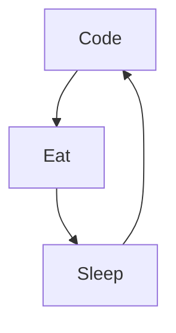

# Maxime NOUKETOU

I'm Maxime from Cameroun, living in Bali 🌴, FullStack developper and Mentor/Teacher, I do content on Development. I really enjoy learning languages and frameworks like spring boot, django, next js and React js.

<!--
**maximedorlin/maximedorlin** is a ✨ _special_ ✨ repository because its `README.md` (this file) appears on your GitHub profile.
-->

Actually:

- 🔭 I’m currently working on a new [Online Course][courses] ...
- 🌱 I’m currently learning amazing things ...
- 👯 I help people to be programmers and freelancers ...
- ⚡ Fun fact : I'am DJ, Diver, Skateboarder and Surfer
- 📫 How to reach me: Instagram or email

## My 100% online React Bootcamp

 <strong>
    3 months to be a really good Full Stack Programmer
  </strong>
  

    Be a Master in React/ Next by building amazing projects
  

  
 

### Connect with me:

&nbsp;&nbsp;

&nbsp;&nbsp;

&nbsp;&nbsp;

&nbsp;&nbsp;

### Languages and Tools:

[][youtubeplaylist]

[][youtubeplaylist]
[][youtubeplaylist]
[][youtubeplaylist]
[][youtubeplaylist]
[][youtubeplaylist]
[][youtubeplaylist]
[][youtubeplaylist]
[][youtubeplaylist]
[][youtubeplaylist]

[][youtubeplaylist]

 
 

### My daily routine :

### 🔥 Recent GitHub Activity

<!--START_SECTION:activity-->

1. 🗣 Commented on [#20](https://github.com/maximedorlin/react-prerequis-debutants/issues/20#issuecomment-2774508570) in [maximedorlin/react-prerequis-debutants](https://github.com/maximedorlin/react-prerequis-debutants)
2. 🗣 Commented on [#488](https://github.com/hashicorp/next-mdx-remote/issues/488#issuecomment-2708027936) in [hashicorp/next-mdx-remote](https://github.com/hashicorp/next-mdx-remote)
3. 🗣 Commented on [#2](https://github.com/maximedorlin/typescript-expert/issues/2#issuecomment-2224266212) in [maximedorlin/typescript-expert](https://github.com/maximedorlin/typescript-expert)
4. 🗣 Commented on [#8](https://github.com/maximedorlin/react-testing/issues/8#issuecomment-2219232858) in [maximedorlin/react-testing](https://github.com/maximedorlin/react-testing)
5. 🗣 Commented on [#1](https://github.com/maximedorlin/typescript-expert/issues/1#issuecomment-2219188953) in [maximedorlin/typescript-expert](https://github.com/maximedorlin/typescript-expert)
<!--END_SECTION:activity-->

### ⭐ GitHub Stats

### 📺 Last Youtube:

<!-- YOUTUBE:START -->

- [📌Code moins, pense plus : ta productivité va exploser](https://www.youtube.com/shorts/JwfWBtwiOjU)
- [La vérité sur mon burn-out créatif](https://www.youtube.com/shorts/qY7Ev6KgSo8)
- [J&#39;arrête Tout ! Et je repars de zéro !](https://www.youtube.com/watch?v=emcHUL3qj5A)
- [😱 Ils codent… sans savoir coder !](https://www.youtube.com/shorts/SxvfR_vObd0)
- [L’IA code plus vite que toi. La preuve en 30 sec](https://www.youtube.com/shorts/gAnL2usYu0E)
<!-- YOUTUBE:END -->

  
📒 Latest blog content

<!-- BLOG-POST-LIST:START -->

- [📌Code moins, pense plus : ta productivité va exploser](https://www.maximedorlin.com/2025/06/23/%f0%9f%93%8ccode-moins-pense-plus-ta-productivite-va-exploser/)
- [La vérité sur mon burn-out créatif](https://www.maximedorlin.com/2025/06/21/la-verite-sur-mon-burn-out-creatif/)
- [J’arrête Tout ! Et je repars de zéro !](https://www.maximedorlin.com/2025/06/19/jarrete-tout-et-je-repars-de-zero/)
- [😱 Ils codent… sans savoir coder !](https://www.maximedorlin.com/2025/06/16/%f0%9f%98%b1-ils-codent-sans-savoir-coder/)
- [L’IA code plus vite que toi. La preuve en 30 sec](https://www.maximedorlin.com/2025/06/09/lia-code-plus-vite-que-toi-la-preuve-en-30-sec/)
  <!-- BLOG-POST-LIST:END -->
  

[courses]: https://go.maximedorlin.com/next-mastery
[website]: https://go.maximedorlin.com/blog
[insta]: https://go.maximedorlin.com/instagram
[Youtube]: https://go.maximedorlin.com/youtube
[youtubeplaylist]: https://www.youtube.com/channel/UC7BNBNLwMF8GjgXLDP8PWQw
