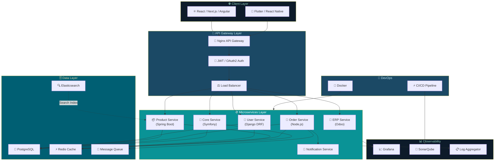
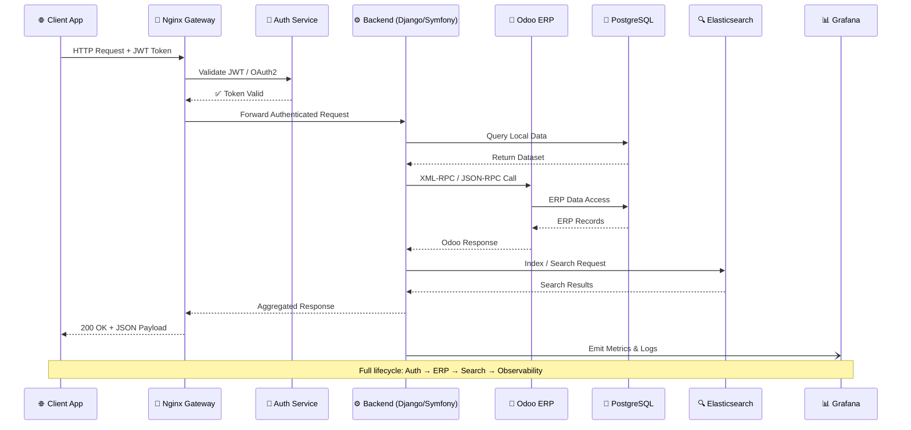
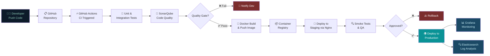
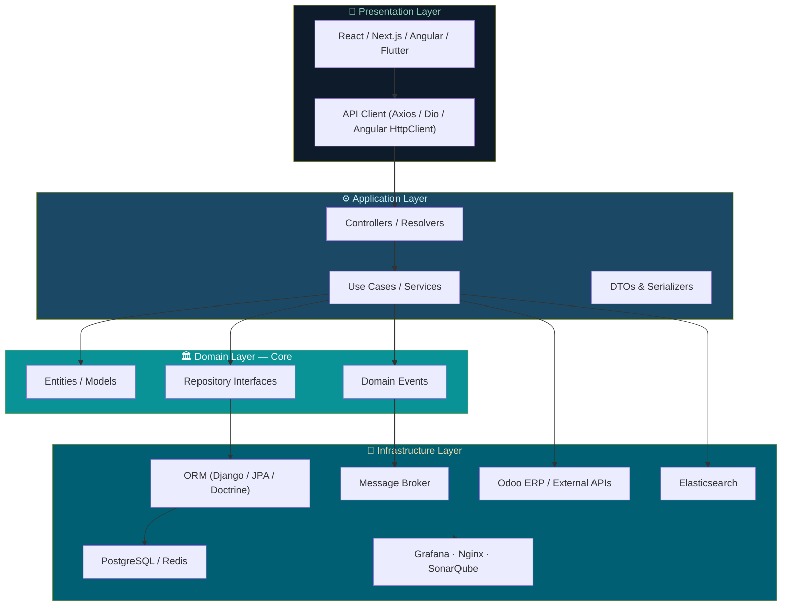
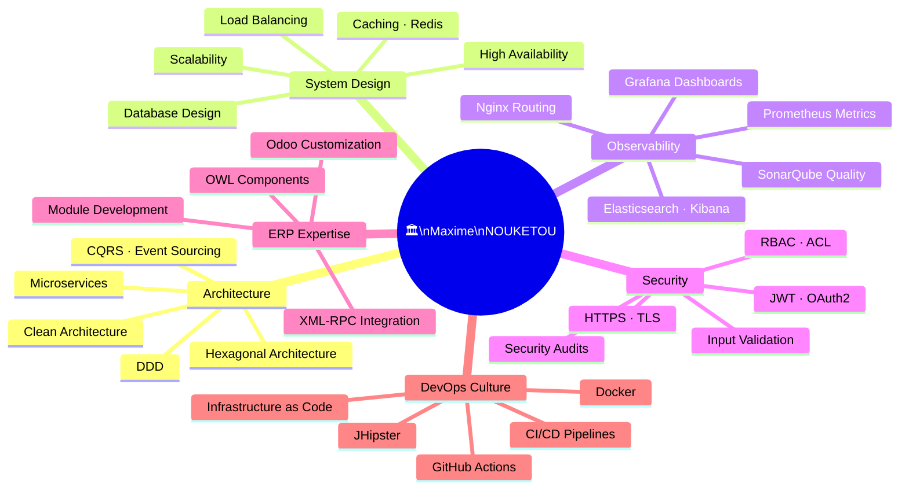

<!-- HERO BANNER -->
<div align="center">


</div>

<!-- ASCII NAME BANNER -->

```
███╗   ███╗ █████╗ ██╗  ██╗██╗███╗   ███╗███████╗    ███╗   ██╗ ██████╗ ██╗   ██╗██╗  ██╗███████╗████████╗ ██████╗ ██╗   ██╗
████╗ ████║██╔══██╗╚██╗██╔╝██║████╗ ████║██╔════╝    ████╗  ██║██╔═══██╗██║   ██║██║ ██╔╝██╔════╝╚══██╔══╝██╔═══██╗██║   ██║
██╔████╔██║███████║ ╚███╔╝ ██║██╔████╔██║█████╗      ██╔██╗ ██║██║   ██║██║   ██║█████╔╝ █████╗     ██║   ██║   ██║██║   ██║
██║╚██╔╝██║██╔══██║ ██╔██╗ ██║██║╚██╔╝██║██╔══╝      ██║╚██╗██║██║   ██║██║   ██║██╔═██╗ ██╔══╝     ██║   ██║   ██║██║   ██║
██║ ╚═╝ ██║██║  ██║██╔╝ ██╗██║██║ ╚═╝ ██║███████╗    ██║ ╚████║╚██████╔╝╚██████╔╝██║  ██╗███████╗   ██║   ╚██████╔╝╚██████╔╝
╚═╝     ╚═╝╚═╝  ╚═╝╚═╝  ╚═╝╚═╝╚═╝     ╚═╝╚══════╝    ╚═╝  ╚═══╝ ╚═════╝  ╚═════╝ ╚═╝  ╚═╝╚══════╝   ╚═╝    ╚═════╝  ╚═════╝
```

<div align="center">

<!-- Typing SVG -->

[](https://git.io/typing-svg)

<br/>


</div>

---

<!-- ═══════════════════════════════════════════════════════════ -->
<!-- SECTION 1 — HERO CODE BLOCK (JAVA)                        -->
<!-- ═══════════════════════════════════════════════════════════ -->

<div align="center">

## 〔 `Hello, World` 〕

</div>

```java
/**
 * ╔══════════════════════════════════════════════════════════════╗
 * ║           MAXIME NOUKETOU — SOFTWARE ARCHITECT              ║
 * ║     Fullstack Engineer · ERP Integrator · SaaS Builder      ║
 * ╚══════════════════════════════════════════════════════════════╝
 *
 * @author   Maxime NOUKETOU
 * @version  PRODUCTION_READY
 * @since    2020
 * @location Cameroon, Africa 🌍
 * @status   Open to Collaboration & Consulting
 */

@SoftwareArchitect
@SeniorEngineer
@ERPSpecialist
public final class MaximeNOUKETOU {

    // ── Identity ────────────────────────────────────────────────
    private static final String NAME     = "Maxime NOUKETOU";
    private static final String ROLE     = "Software Architect & Senior Fullstack Engineer";
    private static final String LOCATION = "Cameroon, Africa 🌍";
    private static final String MISSION  = "Designing systems that scale. Engineering solutions that last.";

    // ── Core Expertise ──────────────────────────────────────────
    private final String[] expertise = {
        "🏗️  Software Architecture & Clean System Design",
        "⚡  Backend Engineering   → Django · Spring Boot · Node.js · Symfony",
        "🎨  Frontend Engineering  → React · Next.js · Vue.js · Angular · TypeScript",
        "📱  Mobile Development    → Flutter · React Native",
        "🔗  ERP Integration       → Odoo · OWL Framework · XML-RPC",
        "☁️  Microservices & SaaS  → Docker · JHipster · API Gateway",
        "🔐  Security & Auth       → JWT · OAuth2 · RBAC · HTTPS",
        "📊  Observability         → Grafana · SonarQube · Elasticsearch · Nginx",
        "🐳  DevOps & CI/CD        → GitHub Actions · Docker · Linux · CI/CD"
    };

    // ── Architecture Principles ─────────────────────────────────
    private final Philosophy philosophy = new Philosophy()
        .add("Clean Architecture")
        .add("Domain Driven Design")
        .add("SOLID Principles")
        .add("Event Driven Architecture")
        .add("Security First")
        .add("Performance by Design")
        .add("High Availability");

    // ── Lifecycle ───────────────────────────────────────────────
    @PostConstruct
    public void initialize() {
        log.info("🚀 Designing systems that scale.");
        log.info("⚙️  Engineering solutions that last.");
        log.info("🎯  Delivering value through great architecture.");
        log.info("🌍  Building from Cameroon. Impacting globally.");
    }

    public String getMission()         { return MISSION; }
    public boolean isAvailableForWork() { return true; }
    public String getCurrentFocus()    {
        return "Enterprise ERP · SaaS Platforms · Microservices Architecture";
    }
}
```

---

<!-- ═══════════════════════════════════════════════════════════ -->
<!-- SECTION 2 — ABOUT ME (PYTHON)                             -->
<!-- ═══════════════════════════════════════════════════════════ -->

<div align="center">

## 〔 `About Me` 〕

</div>

```python
#!/usr/bin/env python3
# -*- coding: utf-8 -*-
# ╔══════════════════════════════════════════════════════════════╗
# ║  about_me.py          Engineer : Maxime NOUKETOU            ║
# ║  Version : PROD       Location : Cameroon 🌍                ║
# ╚══════════════════════════════════════════════════════════════╝

from dataclasses import dataclass, field
from typing import List

@dataclass
class MaximeNOUKETOU:
    """
    Passionate Software Architect & Fullstack Engineer.
    I design robust, scalable, and maintainable systems
    — from architecture blueprints to production deployments.
    """

    name      : str  = "Maxime NOUKETOU"
    title     : str  = "Software Architect · Fullstack Engineer · ERP Integrator"
    location  : str  = "Cameroon 🌍"
    available : bool = True

    passions: List[str] = field(default_factory=lambda: [
        "🏛️  Clean Architecture & Domain Driven Design",
        "🚀  High-performance RESTful APIs & Microservices",
        "🔗  ERP automation & Odoo deep customization",
        "⚙️  Dev industrialization with JHipster & CI/CD",
        "📦  Building SaaS products that solve real problems",
        "📱  Mobile-first experiences: Flutter & React Native",
        "📊  Monitoring & observability: Grafana · Elastic · Sonar",
        "🛡️  Security engineering: JWT · OAuth2 · RBAC · Nginx",
    ])

    currently: List[str] = field(default_factory=lambda: [
        "🔭 Architecting scalable enterprise microservices",
        "🌱 Mastering Event Driven Architecture & CQRS",
        "🤝 Open for freelance, consulting & collaboration",
        "🧩 Contributing to open-source ERP & DevOps tooling",
    ])

    def vision(self) -> str:
        return (
            "Great software is not written — it is engineered. "
            "Every line of code should reflect intention, clarity, and craftsmanship. "
            "My mission: design systems that scale, teams that thrive, "
            "and products that endure far beyond their first release."
        )

    def __repr__(self) -> str:
        return f"<Engineer: {self.name} | {self.title} | 📍 {self.location}>"

if __name__ == "__main__":
    me = MaximeNOUKETOU()
    print(f"👋  Hi, I'm {me.name}")
    print(f"💡  {me.vision()}")
    print(f"📍  {me.__repr__()}")
```

---

<!-- ═══════════════════════════════════════════════════════════ -->
<!-- SECTION 3 — TECH STACK VISUAL                             -->
<!-- ═══════════════════════════════════════════════════════════ -->

<div align="center">

## 〔 `Tech Stack` 〕

### ⚡ Backend

[](https://python.org)
[](https://djangoproject.com)
[](https://java.com)
[](https://spring.io)
[](https://nodejs.org)
[](https://symfony.com)

---

### 🎨 Frontend

[](https://react.dev)
[](https://nextjs.org)
[](https://vuejs.org)
[](https://angular.io)
[](https://typescriptlang.org)
[](https://tailwindcss.com)

---

### 📱 Mobile

[](https://flutter.dev)
[](https://reactnative.dev)

---

### 🗄️ Databases & ERP

[](https://postgresql.org)
[](https://mysql.com)
[](https://redis.io)
[](https://mongodb.com)
[](https://elastic.co)


---

### 🐳 DevOps, Observability & Tools

[](https://docker.com)
[](https://git-scm.com)
[](https://linux.org)
[](https://github.com/features/actions)
[](https://nginx.org)
[](https://grafana.com)


</div>

---

<!-- ═══════════════════════════════════════════════════════════ -->
<!-- SECTION 4 — ARCHITECTURE DIAGRAMS (MERMAID)               -->
<!-- ═══════════════════════════════════════════════════════════ -->

<div align="center">

## 〔 `Architecture Blueprints` 〕

</div>

### 🏗️ Microservices Architecture



---

### 🔗 ERP Integration Flow



---

### 🚀 CI/CD Deployment Pipeline



---

### 🧱 Fullstack Clean Architecture



---

<!-- ═══════════════════════════════════════════════════════════ -->
<!-- SECTION 5 — TYPESCRIPT TECH PROFILE                       -->
<!-- ═══════════════════════════════════════════════════════════ -->

<div align="center">

## 〔 `Tech Profile` 〕

</div>

```typescript
// ╔══════════════════════════════════════════════════════════════╗
// ║  tech-profile.ts          Engineer : Maxime NOUKETOU        ║
// ║  Role : Software Architect & Senior Fullstack Engineer      ║
// ╚══════════════════════════════════════════════════════════════╝

interface TechStack {
  backend: string[];
  frontend: string[];
  mobile: string[];
  erp: string[];
  devops: string[];
  databases: string[];
  observability: string[];
  security: string[];
  architecture: string[];
}

const stack: TechStack = {
  backend: [
    "Python",
    "Django",
    "DRF",
    "Java",
    "Spring Boot",
    "Node.js",
    "Symfony",
  ],
  frontend: [
    "React.js",
    "Next.js",
    "Vue.js",
    "Angular",
    "TypeScript",
    "TailwindCSS",
  ],
  mobile: ["Flutter", "React Native"],
  erp: ["Odoo", "OWL Framework", "XML-RPC", "JSON-RPC", "PostgreSQL"],
  devops: [
    "Docker",
    "Git",
    "Linux",
    "CI/CD",
    "JHipster",
    "GitHub Actions",
    "Nginx",
  ],
  databases: ["PostgreSQL", "MySQL", "Redis", "MongoDB", "Elasticsearch"],
  observability: [
    "Grafana",
    "SonarQube",
    "Elasticsearch",
    "Kibana",
    "Prometheus",
  ],
  security: [
    "JWT",
    "OAuth2",
    "RBAC",
    "HTTPS/TLS",
    "API Rate Limiting",
    "Input Validation",
  ],
  architecture: [
    "Microservices",
    "Clean Architecture",
    "Domain Driven Design",
    "CQRS",
    "Event Driven Architecture",
    "Hexagonal Architecture",
    "API Gateway",
    "REST / OpenAPI",
    "High Availability",
    "Scalability",
    "Security First",
    "Performance by Design",
  ],
};

const principles: string[] = [
  "SOLID",
  "DRY",
  "KISS",
  "YAGNI",
  "Separation of Concerns",
  "Test Driven Development",
  "Security First",
  "Performance by Design",
];

export const buildGreatSoftware = (): void => {
  console.log(
    "🚀 Maxime NOUKETOU — Architecting the future, one commit at a time.",
  );
  console.log(
    `📦 Stack depth: ${Object.values(stack).flat().length} technologies mastered.`,
  );
  console.log(`🏛️  Principles: ${principles.join(" · ")}`);
};
```

---

<!-- ═══════════════════════════════════════════════════════════ -->
<!-- SECTION 6 — ARCHITECT EXPERTISE MINDMAP                   -->
<!-- ═══════════════════════════════════════════════════════════ -->

<div align="center">

## 〔 `Software Architect Expertise` 〕

</div>



---

<!-- ═══════════════════════════════════════════════════════════ -->
<!-- SECTION 7 — GITHUB STATS                                   -->
<!-- ═══════════════════════════════════════════════════════════ -->

<div align="center">

## 〔 `GitHub Analytics` 〕

<br/>


<br/><br/>


<br/><br/>


</div>

---

<!-- ═══════════════════════════════════════════════════════════ -->
<!-- SECTION 8 — PROJECTS PREMIUM                              -->
<!-- ═══════════════════════════════════════════════════════════ -->

<div align="center">

## 〔 `Featured Projects` 〕

</div>

<table>
<tr>
<td width="50%">

### 🏢 Enterprise ERP Platform

> _Odoo-based ERP solution for multi-company management_


- ✅ Custom Odoo modules & OWL components
- ✅ Multi-company, multi-currency support
- ✅ REST API with Nginx reverse proxy
- ✅ Grafana monitoring & SonarQube quality

[](https://github.com/VOTRE_USERNAME/erp-platform)

</td>
<td width="50%">

### ⚡ SaaS Microservices Platform

> _Scalable multi-tenant SaaS with full observability_


- ✅ Spring Boot microservices + JHipster scaffold
- ✅ Angular frontend with full auth flow
- ✅ Grafana dashboards + Elasticsearch logs
- ✅ SonarQube gates in CI/CD pipeline

[](https://github.com/VOTRE_USERNAME/saas-platform)

</td>
</tr>
<tr>
<td width="50%">

### 📱 Cross-Platform Mobile App

> _Flutter + Django REST + real-time features_


- ✅ Flutter cross-platform (iOS + Android)
- ✅ Django REST Framework + Redis cache
- ✅ WebSockets real-time + offline-first
- ✅ JWT auth + Nginx proxy + Docker deploy

[](https://github.com/VOTRE_USERNAME/mobile-app)

</td>
<td width="50%">

### 🔧 Symfony REST API Platform

> _Enterprise REST API built with Symfony & DDD_


- ✅ Symfony 7 + DDD + Clean Architecture
- ✅ Next.js frontend dashboard
- ✅ OpenAPI / Swagger full documentation
- ✅ SonarQube quality + Docker CI/CD

[](https://github.com/VOTRE_USERNAME/symfony-api)

</td>
</tr>
</table>

---

<!-- ═══════════════════════════════════════════════════════════ -->
<!-- SECTION 9 — NEXT.JS CONFIG                                -->
<!-- ═══════════════════════════════════════════════════════════ -->

<div align="center">

## 〔 `Frontend Architecture` 〕

</div>

```javascript
// ╔══════════════════════════════════════════════════════════════╗
// ║  next.config.js — Production Architecture                   ║
// ║  Engineer : Maxime NOUKETOU | Software Architect            ║
// ╚══════════════════════════════════════════════════════════════╝

/** @type {import('next').NextConfig} */

const MAX_ARCH = {
  engineer: "Maxime NOUKETOU",
  role: "Software Architect & Fullstack Engineer",
  frontendStack: [
    "Next.js 14",
    "TypeScript",
    "TailwindCSS",
    "Zustand",
    "React Query",
  ],
  backendAPIs: [
    "Django REST Framework",
    "Spring Boot",
    "Symfony",
    "Node.js/Express",
  ],
  authStrategy: "JWT + Refresh Token Rotation + OAuth2",
  rendering: ["SSR", "SSG", "ISR", "CSR — Context-aware"],
  monitoring: ["Grafana", "SonarQube", "Elasticsearch", "Nginx Metrics"],
  performanceKPIs: {
    LCP: "< 1.2s",
    FID: "< 50ms",
    CLS: "< 0.05",
    TTI: "< 2.0s",
  },
  designPrinciples: [
    "Component-driven development",
    "Feature-based folder structure",
    "API abstraction layers",
    "Optimistic UI updates",
    "Accessibility (a11y) first",
  ],
};

module.exports = {
  reactStrictMode: true,
  swcMinify: true,
  output: "standalone",
  images: { domains: ["cdn.maxnouketou.dev", "api.yourapp.com"] },
  async headers() {
    return [{ source: "/(.*)", headers: securityHeaders }];
  },
  async rewrites() {
    return [
      { source: "/api/:path*", destination: "https://api.yourapp.com/:path*" },
    ];
  },
};
// 🚀 Architected for performance. Engineered for scale by Maxime NOUKETOU.
```

---

<!-- ═══════════════════════════════════════════════════════════ -->
<!-- SECTION 10 — OBSERVABILITY STACK (BASH)                   -->
<!-- ═══════════════════════════════════════════════════════════ -->

<div align="center">

## 〔 `Observability & DevOps Stack` 〕

</div>

```bash
#!/bin/bash
# ╔══════════════════════════════════════════════════════════════╗
# ║  devops-stack.sh        Engineer : Maxime NOUKETOU          ║
# ║  Mission : Zero downtime. Full observability. Always on.    ║
# ╚══════════════════════════════════════════════════════════════╝

ENGINEER="Maxime NOUKETOU"
MISSION="High Availability · Zero Downtime · Full Observability"

# ── Observability Stack ─────────────────────────────────────────
declare -A OBSERVABILITY=(
  ["Grafana"]="Real-time dashboards & alerting"
  ["Prometheus"]="Metrics collection & time-series DB"
  ["Elasticsearch"]="Log aggregation & full-text search"
  ["Kibana"]="Log visualization & analytics"
  ["SonarQube"]="Continuous code quality & security gates"
)

# ── Infrastructure Stack ────────────────────────────────────────
declare -A INFRA=(
  ["Nginx"]="Reverse proxy · Load balancer · TLS termination"
  ["Docker"]="Containerization & orchestration"
  ["GitHub_Actions"]="CI/CD automation pipelines"
  ["JHipster"]="Microservices scaffolding & generation"
  ["Linux"]="Server administration & shell scripting"
)

# ── Security Stack ──────────────────────────────────────────────
declare -A SECURITY=(
  ["JWT"]="Stateless authentication tokens"
  ["OAuth2"]="Authorization framework"
  ["RBAC"]="Role-based access control"
  ["HTTPS_TLS"]="Transport layer security"
  ["Nginx_WAF"]="Web Application Firewall rules"
)

# ── Deploy Pipeline ─────────────────────────────────────────────
deploy_to_production() {
  echo "🔎 Running SonarQube quality gate..."
  echo "🐳 Building Docker image..."
  echo "🔀 Routing via Nginx load balancer..."
  echo "📊 Emitting metrics to Grafana..."
  echo "🔍 Indexing logs in Elasticsearch..."
  echo "✅ Production deployment complete!"
  echo "🚀 Engineered by: $ENGINEER"
  echo "🎯 Mission: $MISSION"
}

deploy_to_production
```

---

<!-- ═══════════════════════════════════════════════════════════ -->
<!-- SECTION 11 — PHILOSOPHY (YAML)                            -->
<!-- ═══════════════════════════════════════════════════════════ -->

<div align="center">

## 〔 `Development Philosophy` 〕

</div>

```yaml
# ╔══════════════════════════════════════════════════════════════╗
# ║  philosophy.yml            Author : Maxime NOUKETOU         ║
# ║  Mindset : Software Craftsman & System Thinker              ║
# ╚══════════════════════════════════════════════════════════════╝

engineer: "Maxime NOUKETOU"
mindset: "Software Craftsman · System Architect · Continuous Learner"

principles:
  code_quality:
    - "Write code for humans first, machines second."
    - "Clean code is not a luxury — it is a requirement."
    - "SonarQube gates don't lie. Fix the smell, not the metric."

  architecture:
    - "Design for change: today's feature is tomorrow's legacy."
    - "Separate concerns. Always. No exceptions."
    - "The best architecture is the simplest one that solves the problem."
    - "Observability is not optional — Grafana should never surprise you."

  performance:
    - "Measure before you optimize. Elasticsearch shows the truth."
    - "Cache strategically with Redis. Invalidate carefully."
    - "Nginx config is architecture. Treat it like code."

  security:
    - "Security is not a feature — it is a foundation."
    - "JWT expiry is not optional. Refresh tokens are not magic."
    - "Fail securely. Log with Elasticsearch. Alert via Grafana."

  devops:
    - "If it is not in CI/CD, it does not exist."
    - "Docker makes environments honest."
    - "A SonarQube red gate is a production blocker. Always."

  delivery:
    - "Ship small. Iterate fast. Observe everything."
    - "Automate the boring. Engineer the valuable."
    - "The pipeline is as important as the feature."

motto: >
  "Engineer solutions that outlast trends.
   Build systems that outlive teams.
   Observe everything. Secure everything. Scale everything."
```

---

<!-- ═══════════════════════════════════════════════════════════ -->
<!-- SECTION 12 — CONTACT PREMIUM                              -->
<!-- ═══════════════════════════════════════════════════════════ -->

<div align="center">

## 〔 `Let's Connect` 〕

<br/>

[](https://linkedin.com/in/VOTRE_PROFIL)
[](mailto:votre@email.com)
[](https://yourportfolio.dev)
[](https://github.com/VOTRE_USERNAME)
[](https://wa.me/VOTRE_NUMERO)

<br/>

> _"The best time to build scalable software was yesterday. The second best time is now."_
> — **Maxime NOUKETOU**

<br/>

<!-- Snake contribution animation -->


<br/>


</div>
